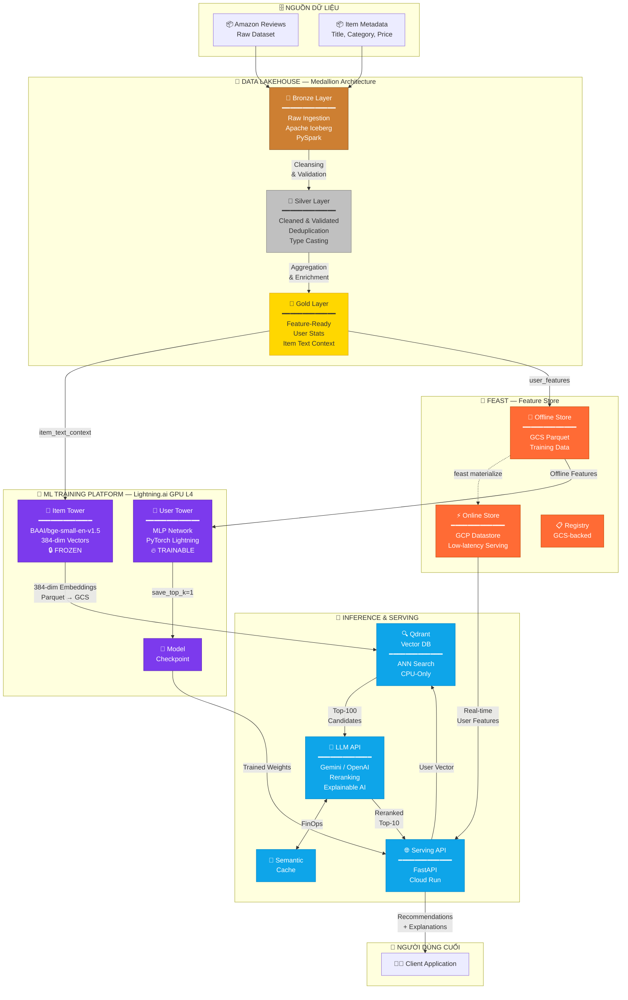
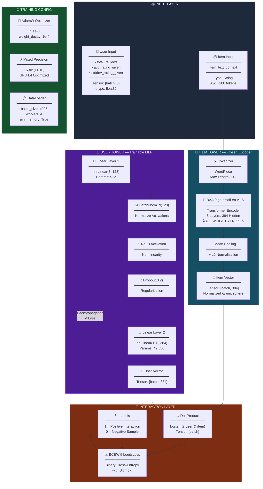
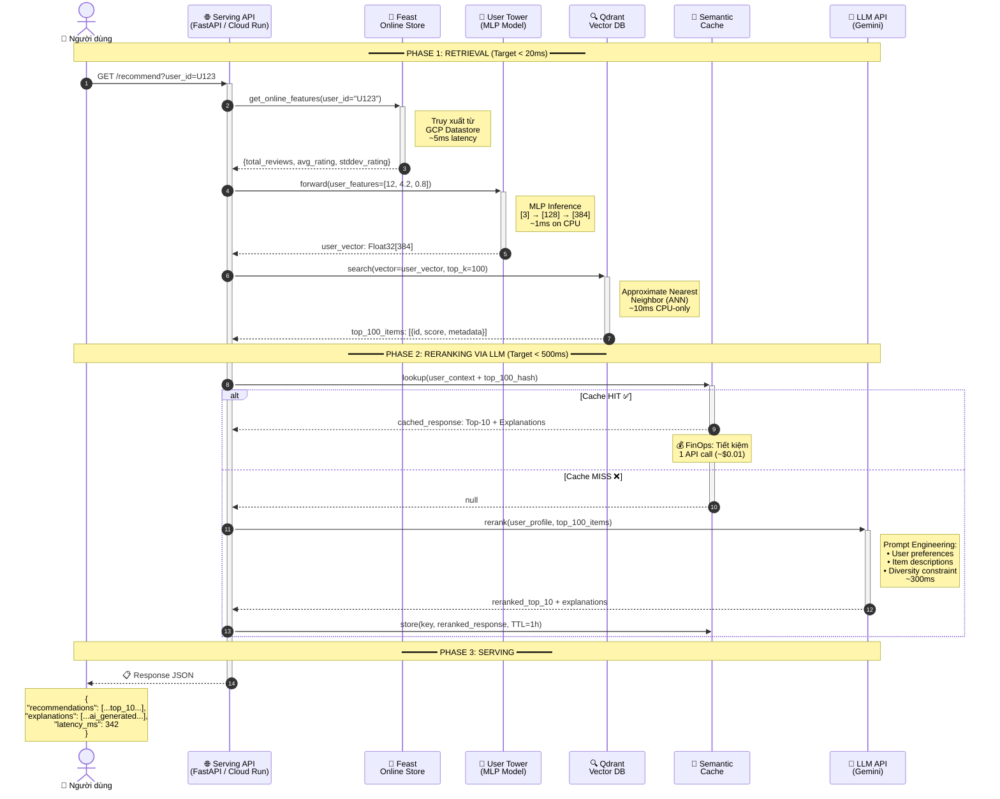
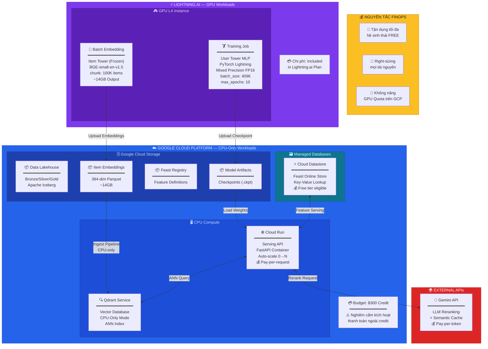

<](https://python.org)
[](https://pytorch.org)
[](https://lightning.ai)
[](https://cloud.google.com)
[](https://iceberg.apache.org)
[](https://feast.dev)

---

*Hệ thống gợi ý sản phẩm quy mô lớn trên tập dữ liệu **Amazon Reviews**, sử dụng kiến trúc **Two-Tower Neural Network** kết hợp **LLM Reranking**, xây dựng trên nền tảng **Data Lakehouse** (Medallion Architecture) và tối ưu vận hành theo nguyên tắc **FinOps**.*

</div>

---

## 📑 Mục lục

- [Tổng quan](#-tổng-quan)
- [1. Sơ đồ Kiến trúc Tổng thể](#1--sơ-đồ-kiến-trúc-tổng-thể-high-level-system-architecture)
- [2. Sơ đồ Luồng Dữ liệu & Quản lý Đặc trưng](#2--sơ-đồ-luồng-dữ-liệu--quản-lý-đặc-trưng-data--feature-pipeline)
- [3. Sơ đồ Kiến trúc Liên kết Tháp Đôi](#3--sơ-đồ-kiến-trúc-liên-kết-tháp-đôi-two-tower-neural-network)
- [4. Sơ đồ Quá trình Suy luận Thời gian thực](#4--sơ-đồ-quá-trình-suy-luận-thời-gian-thực-real-time-inference)
- [5. Sơ đồ Phân bổ Hạ tầng & FinOps](#5--sơ-đồ-phân-bổ-hạ-tầng--finops-cloud-infra--finops-topology)
- [Cấu trúc Mã nguồn](#-cấu-trúc-mã-nguồn)
- [Hướng dẫn Cài đặt & Sử dụng](#-hướng-dẫn-cài-đặt--sử-dụng)
- [Trạng thái Dự án](#-trạng-thái-dự-án)

---

## 🔭 Tổng quan

Dự án xây dựng một **hệ thống gợi ý (Recommendation System)** end-to-end với ba tầng phễu chính:

| Tầng | Vai trò | Công nghệ | Độ trễ mục tiêu |
|------|---------|------------|:----------------:|
| **Retrieval** | Truy xuất Top-K ứng viên từ hàng triệu sản phẩm | Two-Tower + Qdrant (ANN) | < 20ms |
| **Ranking** | Xếp hạng lại bằng LLM với ngữ cảnh cá nhân hóa | Gemini / OpenAI API | < 500ms |
| **Serving** | Trả kết quả cuối cùng cho người dùng | Cloud Run / FastAPI | < 50ms |

**Điểm nổi bật kỹ thuật:**
- 🧊 **Data Lakehouse** kiến trúc Medallion (Bronze → Silver → Gold) trên Apache Iceberg + PySpark
- 🏗️ **Two-Tower Architecture** với Item Tower đóng băng (BAAI/bge-small-en-v1.5) và User Tower huấn luyện bằng MLP
- 🧠 **Feature Store** (Feast) tách biệt Online/Offline Store chống Data Leakage
- 💰 **FinOps-first**: Tách GPU (Lightning.ai) / CPU (GCP), Semantic Caching cho LLM

---

## 1. 🏛️ Sơ đồ Kiến trúc Tổng thể (High-Level System Architecture)

> Sơ đồ mô tả toàn cảnh hệ thống từ nguồn dữ liệu thô đến phục vụ người dùng cuối, chia thành các tầng xử lý rõ ràng.



**Giải thích các tầng:**

| Ký hiệu | Tầng | Chức năng |
|:--------:|-------|-----------|
| 🗄️ | **Nguồn dữ liệu** | Tập dữ liệu Amazon Reviews thô, bao gồm đánh giá và metadata sản phẩm |
| 🧊 | **Data Lakehouse** | Xử lý dữ liệu theo kiến trúc Medallion (Bronze → Silver → Gold) bằng Apache Iceberg + PySpark |
| 🏪 | **Feature Store** | Feast quản lý đặc trưng, tách biệt Offline Store (Training) và Online Store (Serving) |
| 🧠 | **ML Training** | Huấn luyện mô hình Two-Tower trên GPU L4 (Lightning.ai) |
| 🔮 | **Inference & Serving** | Vector search (Qdrant) + LLM reranking + API serving |

---

## 2. 📊 Sơ đồ Luồng Dữ liệu & Quản lý Đặc trưng (Data & Feature Pipeline)

> Sơ đồ chi tiết quá trình biến đổi dữ liệu thô thành đặc trưng sẵn sàng cho huấn luyện và phục vụ, tuân thủ nguyên tắc chống rò rỉ dữ liệu (Data Leakage Prevention).

```mermaid
flowchart LR
    subgraph RAW["📥 DỮ LIỆU THÔ"]
        R1["Amazon Reviews<br/>JSON/CSV"]
        R2["Item Metadata<br/>JSON"]
    end

    subgraph BRONZE_LAYER["🥉 BRONZE — Raw Ingestion"]
        B1["PySpark Reader<br/>━━━━━━━━━━━━━━━<br/>• Schema Inference<br/>• Partition by Category<br/>• Apache Iceberg Format"]
    end

    subgraph SILVER_LAYER["🥈 SILVER — Cleansing & Validation"]
        S1["Data Quality<br/>━━━━━━━━━━━━━━━<br/>• Null Handling<br/>• Deduplication<br/>• Type Casting<br/>• Outlier Detection"]
        S2["Entity Resolution<br/>━━━━━━━━━━━━━━━<br/>• user_id Normalization<br/>• item_id Mapping<br/>• Timestamp Alignment"]
    end

    subgraph GOLD_LAYER["🥇 GOLD — Feature Engineering"]
        direction TB
        G1["👤 User Features<br/>━━━━━━━━━━━━━━━<br/>• total_reviews: Int64<br/>• avg_rating_given: Float32<br/>• stddev_rating_given: Float32"]
        G2["📦 Item Features<br/>━━━━━━━━━━━━━━━<br/>• item_text_context: String<br/>  ↳ title + category +<br/>    avg review summary"]
        G3["🎯 Training Data<br/>━━━━━━━━━━━━━━━<br/>• user_id, item_id<br/>• label: Binary (0/1)<br/>• Negative Sampling"]
    end

    subgraph FEAST_STORE["🏪 FEAST FEATURE STORE"]
        direction TB
        FS_DEF["📋 Feature Definition<br/>━━━━━━━━━━━━━━━<br/>features.py<br/>━━━━━━━━━━━━━━━<br/>Entity: user_id (STRING)<br/>View: user_statistical_features<br/>TTL: 3650 days"]
        FS_OFFLINE["📁 Offline Store<br/>━━━━━━━━━━━━━━━<br/>GCS Parquet Files<br/>✅ Cho TRAINING<br/>🔒 Point-in-time Join"]
        FS_ONLINE["⚡ Online Store<br/>━━━━━━━━━━━━━━━<br/>GCP Datastore<br/>✅ Cho SERVING<br/>⚡ Low-latency Lookup"]
        FS_REG["📡 Registry<br/>GCS-backed"]
        FS_DEF --> FS_OFFLINE & FS_ONLINE
        FS_OFFLINE -->|"feast materialize<br/>━━━━━━━━━━━━━━━<br/>Batch Sync"| FS_ONLINE
    end

    subgraph EMBEDDING_PIPELINE["⚡ EMBEDDING PIPELINE"]
        direction TB
        EMB_MODEL["🤖 BAAI/bge-small-en-v1.5<br/>━━━━━━━━━━━━━━━<br/>SentenceTransformer<br/>FP16 • GPU L4"]
        EMB_CHUNK["📦 Chunk Processing<br/>━━━━━━━━━━━━━━━<br/>chunk_size: 100,000<br/>batch_size: 512<br/>PyArrow Lazy Read"]
        EMB_UPLOAD["☁️ Async Upload<br/>━━━━━━━━━━━━━━━<br/>ThreadPool (4 workers)<br/>Fire-and-Forget<br/>Snappy Compression"]
        EMB_OUTPUT["💎 Item Embeddings<br/>━━━━━━━━━━━━━━━<br/>384-dim Float32<br/>Parquet on GCS<br/>~14GB Total"]
        EMB_MODEL --> EMB_CHUNK --> EMB_UPLOAD --> EMB_OUTPUT
    end

    subgraph TRAINING_DATA["🎯 TRAINING OUTPUT"]
        TD["training_data/<br/>part-00000.parquet<br/>━━━━━━━━━━━━━━━<br/>user_features ⊕<br/>item_embeddings ⊕<br/>binary labels"]
    end

    R1 & R2 --> B1
    B1 --> S1 --> S2
    S2 --> G1 & G2 & G3
    G1 --> FS_DEF
    G2 --> EMB_MODEL
    G3 --> TD
    FS_OFFLINE -.->|"🔒 TRAIN ONLY<br/>Anti Data Leakage"| TD
    EMB_OUTPUT -.->|"Item Vectors"| TD

    style RAW fill:#1e293b,stroke:#475569,color:#e2e8f0
    style BRONZE_LAYER fill:#92400e,stroke:#78350f,color:#fef3c7
    style SILVER_LAYER fill:#6b7280,stroke:#4b5563,color:#f3f4f6
    style GOLD_LAYER fill:#854d0e,stroke:#713f12,color:#fef9c3
    style FEAST_STORE fill:#9a3412,stroke:#7c2d12,color:#fed7aa
    style EMBEDDING_PIPELINE fill:#581c87,stroke:#3b0764,color:#e9d5ff
    style TRAINING_DATA fill:#065f46,stroke:#064e3b,color:#a7f3d0
```



**Nguyên tắc chống Data Leakage:**

```
┌─────────────────────────────────────────────────────────────┐
│  🔒 TRAINING PHASE          │  ⚡ SERVING PHASE             │
│  ─────────────────           │  ──────────────────           │
│  ✅ Offline Store (Parquet)  │  ✅ Online Store (Datastore)  │
│  ✅ Point-in-time Join       │  ✅ Real-time Lookup          │
│  ❌ KHÔNG dùng Online Store  │  ❌ KHÔNG dùng Offline Store  │
└─────────────────────────────────────────────────────────────┘
```

---

## 3. 🧠 Sơ đồ Kiến trúc Liên kết Tháp Đôi (Two-Tower Neural Network)

> Sơ đồ mô tả chi tiết kiến trúc mạng nơ-ron Tháp Đôi, bao gồm cấu trúc từng tầng, kích thước tensor, và cơ chế tương tác giữa hai tháp.



**Tóm tắt Kiến trúc:**

```
USER FEATURES ──► [3] ──► Linear(128) ──► BN ──► ReLU ──► Dropout ──► Linear(384) ──► User Vector ─┐
                                                                                                     ├──► Dot Product ──► σ(logit) ──► Loss
ITEM TEXT ──────► Tokenize ──► BGE-small (Frozen, 384-dim) ──► L2 Norm ──► Item Vector ──────────────┘
```

| Thành phần | Tham số | Chi tiết |
|------------|---------|----------|
| **User Tower** | ~50,048 params | 2-layer MLP, Trainable |
| **Item Tower** | ~33M params | Pre-trained BERT, Frozen |
| **Output Dim** | 384 | Cả hai tháp cùng chiều không gian |
| **Loss** | BCEWithLogitsLoss | Phân loại nhị phân (tương tác / không tương tác) |
| **Optimizer** | AdamW | lr=1e-3, weight_decay=1e-4 |

---

## 4. 🔄 Sơ đồ Quá trình Suy luận Thời gian thực (Real-time Inference)

> Sơ đồ tuần tự mô tả luồng xử lý từ khi người dùng gửi yêu cầu cho đến khi nhận được danh sách gợi ý cuối cùng, bao gồm các bước truy xuất đặc trưng, sinh vector, tìm kiếm láng giềng gần nhất, và reranking bằng LLM.



**Breakdown độ trễ từng bước:**

```
┌──────────────────────────────────────────────────────────────┐
│  RETRIEVAL PHASE                              Total: ~16ms   │
│  ├── Feast Online Lookup ················· ~5ms              │
│  ├── User Tower MLP Inference ············ ~1ms              │
│  └── Qdrant ANN Search (Top-100) ········· ~10ms             │
│                                                              │
│  RERANKING PHASE                              Total: ~300ms  │
│  ├── Semantic Cache Lookup ··············· ~2ms              │
│  ├── LLM API Call (if cache miss) ········ ~300ms            │
│  └── Cache Store ························· ~1ms              │
│                                                              │
│  END-TO-END (with cache hit) ··············· ~20ms           │
│  END-TO-END (with cache miss) ·············· ~320ms          │
└──────────────────────────────────────────────────────────────┘
```

---

## 5. ☁️ Sơ đồ Phân bổ Hạ tầng & FinOps (Cloud Infra & FinOps Topology)

> Sơ đồ mô tả cách phân bổ tài nguyên hạ tầng đám mây theo nguyên tắc FinOps — tách biệt môi trường GPU (Training) và CPU (Serving), tối ưu chi phí trên Google Cloud $300 credit.



**Bảng Phân bổ Chi phí:**

| Thành phần | Nền tảng | Loại | Chi phí ước tính | Ghi chú |
|:----------:|:--------:|:----:|:-----------------:|---------|
| Training (GPU L4) | Lightning.ai | GPU | Included | Tách riêng khỏi GCP budget |
| Batch Embedding | Lightning.ai | GPU | Included | Chạy 1 lần, ~14GB output |
| Cloud Storage (GCS) | GCP | Storage | ~$5/tháng | Lakehouse + Embeddings + Registry |
| Cloud Datastore | GCP | Database | Free tier | Feast Online Store |
| Qdrant | GCP (VM/Container) | CPU | ~$15/tháng | CPU-only, nhỏ gọn |
| Cloud Run | GCP | Serverless | Pay-per-use | Scale-to-zero khi rảnh |
| Gemini API | Google AI | API | Pay-per-token | Giảm ~60% nhờ Semantic Cache |

**Chiến lược tiết kiệm chi phí:**

```
┌─────────────────────────────────────────────────────────────┐
│  💡 FINOPS BEST PRACTICES                                   │
│                                                             │
│  1. GPU ISOLATION: Mọi tác vụ GPU chạy trên Lightning.ai   │
│     → GCP credit chỉ dùng cho CPU/Storage/DB               │
│                                                             │
│  2. SEMANTIC CACHING: Cache kết quả LLM reranking          │
│     → Giảm ~60% lượng API call tới Gemini                  │
│                                                             │
│  3. SCALE-TO-ZERO: Cloud Run tự động tắt khi không có      │
│     request → $0 khi hệ thống rảnh                         │
│                                                             │
│  4. CPU-ONLY QDRANT: Không cần GPU cho Vector Search       │
│     → Tiết kiệm >$200/tháng so với GPU-based               │
│                                                             │
│  5. NO GPU QUOTA: Không nâng quota GPU trên GCP             │
│     → Ngăn chặn kích hoạt billing ngoài $300 credit        │
└─────────────────────────────────────────────────────────────┘
```

---

## 📁 Cấu trúc Mã nguồn

```
mining_massive/
│
├── 📄 plan.txt                    # Tài liệu kỹ thuật & tiến độ dự án
├── 📄 requirements.txt            # Dependencies (PyTorch, Lightning, PyArrow, ...)
├── 📄 README.md                   # Tài liệu bạn đang đọc
│
├── 🧊 DATA LAKEHOUSE (Notebooks)
│   ├── 📓 bronze.ipynb            # Bronze Layer: Raw ingestion từ Amazon Reviews
│   ├── 📓 silver_singler.ipynb    # Silver Layer: Cleansing & Validation
│   ├── 📓 silver_gold.ipynb       # Silver → Gold: Aggregation & Feature Engineering
│   ├── 📓 user_features.ipynb     # Gold Layer: Tính toán User Statistical Features
│   └── 📓 event_timestamp.ipynb   # Xử lý Event Timestamp cho Feast compatibility
│
├── 🏪 FEATURE STORE
│   └── 📄 features.py             # Feast Feature Definitions (Entity, FeatureView)
│
├── ⚡ EMBEDDING PIPELINE
│   └── 📄 embedding.py            # Item Tower: BGE embedding + GCS upload (chunked)
│
├── 🧠 ML TRAINING
│   ├── 📄 model.py                # UserTowerLightning: MLP architecture (PyTorch Lightning)
│   ├── 📄 dataset.py              # UserTowerDataset: PyTorch Dataset wrapper
│   ├── 📄 train.py                # Training script: DataLoader, Trainer, Checkpoint
│   ├── 📄 download_data.py        # GCS → Local: Multi-threaded data download
│   └── 📓 generate_training_data.ipynb  # Sinh dữ liệu huấn luyện (Positive + Negative)
│
└── 🔮 INFERENCE (Coming Soon)
    ├── 📄 predict.py              # [Planned] User embedding inference
    └── 📄 eval.py                 # [Planned] Offline evaluation (Hit Ratio, NDCG)
```

---

## 🚀 Hướng dẫn Cài đặt & Sử dụng

### Yêu cầu Hệ thống

- Python 3.10+
- CUDA-compatible GPU (khuyến nghị NVIDIA L4 hoặc tương đương)
- Google Cloud SDK (đã xác thực)
- ~20GB RAM cho quá trình embedding

### 1. Cài đặt Dependencies

```bash
pip install -r requirements.txt
pip install sentence-transformers feast google-cloud-storage gcsfs
```

### 2. Tải Dữ liệu từ GCS

```bash
# Tải Item Embeddings (~14GB) và Training Data từ GCS về local
python download_data.py
```

### 3. Chạy Embedding Pipeline (nếu cần tái tạo)

```bash
# Chạy trên GPU - sinh 384-dim vectors cho toàn bộ items
python embedding.py
```

### 4. Huấn luyện User Tower

```bash
# Huấn luyện MLP trên GPU L4 với Mixed Precision
python train.py
# Checkpoint tốt nhất được lưu tại: model_checkpoints/
```

### 5. Feast Feature Store

```bash
# Áp dụng Feature Definitions
feast apply

# Materialize features từ Offline → Online Store
feast materialize <START_DATE> <END_DATE>
```

---

## 📋 Trạng thái Dự án

| Hạng mục | Trạng thái | Ghi chú |
|----------|:----------:|---------|
| Data Lakehouse (Medallion) | ✅ Hoàn thành | Bronze → Silver → Gold trên Apache Iceberg |
| Item Tower Embedding | ✅ Hoàn thành | ~14GB vectors trên GCS |
| Feast Feature Store | ✅ Hoàn thành | Online Store (Datastore) hoạt động ổn định |
| User Tower Training | 🔄 Đang chạy | MLP training trên GPU L4 |
| Inference Pipeline | 📋 Lên kế hoạch | predict.py + Qdrant integration |
| Offline Evaluation | 📋 Lên kế hoạch | Hit Ratio, NDCG metrics |
| LLM Reranking | 📋 Lên kế hoạch | Gemini API + Semantic Cache |
| Serving API | 📋 Lên kế hoạch | FastAPI trên Cloud Run |

---

<div align="center">

### 🛠️ Tech Stack


**Phạm Minh Quang** · 2A202600263 · Mining Massive Datasets

</div>
]]>
